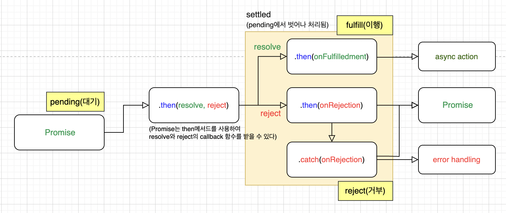
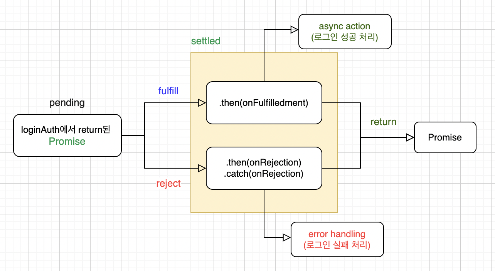
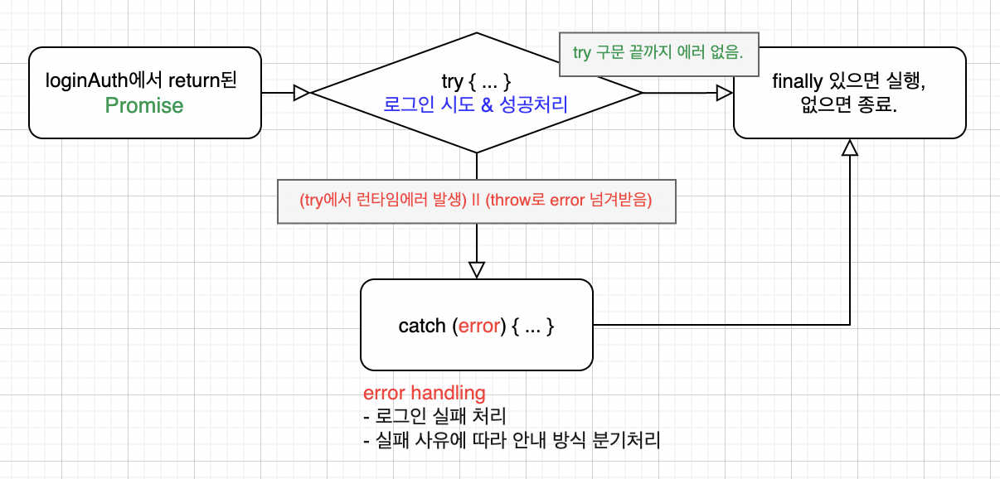
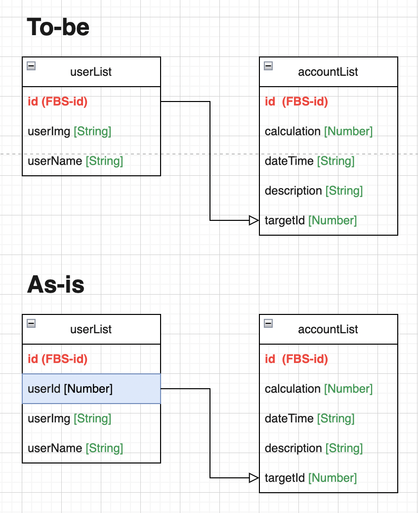
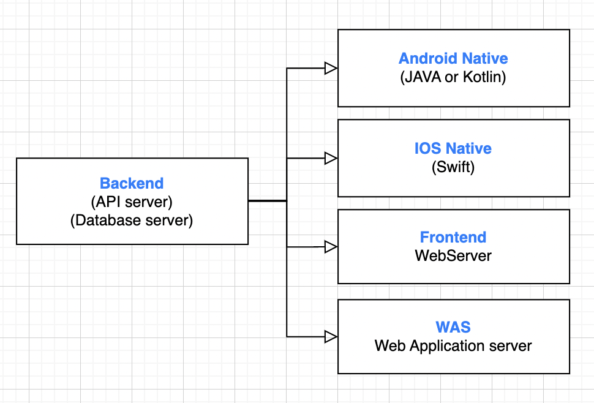
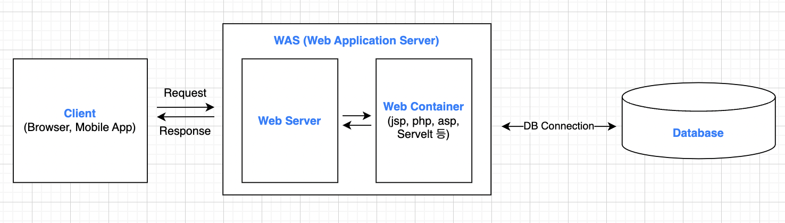

 

## 🎢 Algorithm Flowchart

- 개발 문서 작성 시 Algorithm Flowchart가 종종 필요함.
- 연습 목적으로 해당 Repository를 생성하였고, 스터디 목적으로 그려본 Flowchart를 기록.

 

## 🚇 Outputs

- then-catch Promise (method 관점) 
  

- then-catch Promise (state 관점) 
  

- try-catch 
  

- AccountListBook ERD 
  

- Server 
  

- WAS(Web Application Server) 
  
